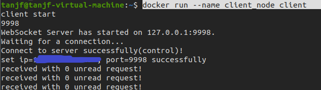

## 存储系统主节点（server）的部署补充

部署 server 节点时，运行完 docker-compose up 后，按如下操作导入初始 mysql 数据库。

1. 进入 mymysql 容器。

   ```shell
   docker exec -it mymysql bin/bash
   ```

2. 进入后在容器内的命令行输入如下命令，创建名为 DFS 的数据库。

   ```mysql
   mysql -uroot -p201314 -e "create database DFS;"
   ```

3. 再输入如下命令，将 /xyy.sql 的内容导入 DFS 数据库。

   ```mysql
   mysql -uroot -p201314 -D DFS</xyy.sql
   ```

由此完成了初始数据库的导入。


## 存储系统子节点（client）的部署

1. 在文件夹 client_docker 内运行如下指令，创建 docker 镜像。

   ```shell
   docker build -t client .
   ```

2. 运行该镜像，生成并运行相对应的容器

   ```shell
   docker run --name client_node client 
   ```

3. 存储系统的子节点就部署好了，对应的输出内容如下（注意要先开 server ，才能连接 client 节点）

   


## 打标服务器的部署

注意：部署的时候最好连校园网，用 nltk.downloader 的时候关掉代理，建立镜像的时候不要跑其他 docker 容器。由于下载源中有很多外网，网络连接相当不稳定，因此若一次没成功建立起容器，可以多跑几次试试。

1. 进入 docker-ray 文件夹并运行如下指令，以生成镜像

   ```shell
   docker build -t tag_server .
   ```

2. 建立好后运行如下指令，以建立容器

   ```shell
   docker run -idt --name tag tag_server
   ```

3. 再运行如下指令进入容器

   ```shell
   docker exec -it tag bin/bash
   ```

4. 在容器的命令行中输入如下指令，以启动 ray 的头节点

   ```shell
   ray start --head --port=6379
   ```

5. 最后进入 ray_tagging 文件夹，并输入如下指令即可成功部署打标服务器（注意要先开 neo4j 和 中央索引服务器）

   ```python
   python3 tag_server.py
   ```

6. 运行后的效果如下：

   

   

 
