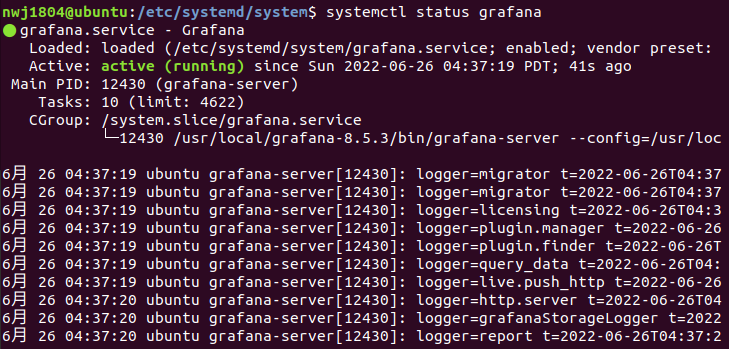
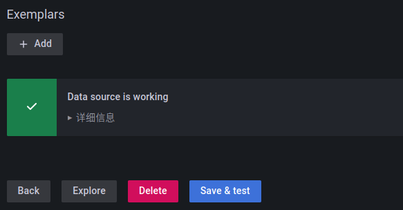
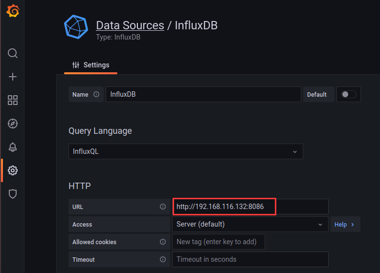

# Grafana

## 安装试运行

**Step1：** 从官网上下载并解压：

```shell
wget https://dl.grafana.com/enterprise/release/grafana-enterprise-8.5.3.linux-amd64.tar.gz
tar -zxvf grafana-enterprise-8.5.3.linux-amd64.tar.gz
mv grafana-8.5.3 /usr/local
```

**Remark：** wget下载默认路径为当前路径

**Step2：** 试运行

```shell
cd /usr/local
cd grafana-8.5.3/
cd bin/
./grafana-server
```

保持终端，浏览器访问`192.168.116.129:3000` 出现Grafana界面，默认用户名和密码都是admin，新密码修改为201314，出现如下界面说明正常：


**Step3：** 设置开机启动

在`/etc/systemd/system`下创建grafana.service文件并打开：

```shell
cd /etc/systemd/system
sudo touch grafana.service
sudo vim grafana.service
```

写入以下内容：

```vim
[Unit]
Description=Grafana
After=network.target

[Service]
ExecStart=/usr/local/grafana-8.5.3/bin/grafana-server \
 --config=/usr/local/grafana-8.5.3/conf/defaults.ini \
 --homepath=/usr/local/grafana-8.5.3

[Install]
WantedBy=multi-user.target
```

保存退出。

启动服务并设置开机启动：

```shell
systemctl daemon-reload
systemctl enable grafana.service
systemctl start grafana.service
systemctl status grafana.service
```

出现如下显示说明成功：



**Step4：** 添加Prometheus数据源

浏览器访问192.168.116.129:3000，登录

左侧菜单栏：Configuration -> Data Sources -> Prometheus到如下界面，将URL改为自己的IP加默认端口9090：


其余默认，点击Save&Test至显示如下：



**Step4‘：** 添加InfluxDB数据源

浏览器访问192.168.116.129:3000，登录

左侧菜单栏：Configuration -> Data Sources -> InfluxDB到如下界面，将URL改为自己的IP加默认端口8086：



然后按照如下修改：


## 使用

一个row包含多个panel，一个panel对应监控一个指标。
