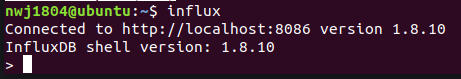

# InfluxDB安装以及与Prometheus的对接

## 安装InfluxDB

**Step1：** 添加InfluxDB的仓库

```shell
curl -sL https://repos.influxdata.com/influxdb.key | sudo apt-key add -
source /etc/lsb-release
echo "deb https://repos.influxdata.com/${DISTRIB_ID,,} ${DISTRIB_CODENAME} stable" | sudo tee /etc/apt/sources.list.d/influxdb.list
```

**Step2：** 安装InfluxDB：

```shell
sudo apt-get update
sudo apt-get install influxdb
```

**Step3：** 设置开机自启动并启动服务

```shell
systemctl daemon-reload
systemctl enable influxdb
systemctl start influxdb
systemctl status influxdb
```

出现如下显示说明成功：


## InfluxDB 与Prometheus对接

当安装完毕后输入`influx` 然后就弹出如下界面：



接下来可以创建数据库以及用户

```shell
# 创建名称为prometheus的数据库实例
create database prometheus
# 切换数据库实例prometheus
use prometheus
# 创建用户名和密码都为node的用户，注意密码只能用''字符否则influxdb将会报错
create user "node" with password 'node'
```

> Remote storage adapter插件：这个是prometheus官方提供的写适配器插件，通过Prometheus的远程写协议接收样本，并将它们存储在Graphite, InfluxDB, or OpenTSDB 中。

下载此插件需要机器拥有go环境，这样就可以自主编译remote_storage_adapter插件。如果没有go环境也不想编译此组件，也可以下载编译好的组件：

链接: https://pan.baidu.com/s/1DJpoYDOIfCeAFC6UGY22Xg 提取码: uj42

运行插件：

```shell
./remote_storage_adapter --influxdb-url=http://127.0.0.1:8086/ --influxdb.database="prometheus" --influxdb.retention-policy=autogen
```

配置 prometheus.yml，在最后加入以下内容：

```shell
# 远程写配置
remote_write:
  - url: "http://localhost:9201/write"
  # 配置连接influxdb连接的用户名与密码
    basic_auth:
      username: node
      password: node
# 远程读配置
remote_read:
  - url: "http://localhost:9201/read"
    basic_auth:
      username: node
      password: node
```

重启prometheus：

```shell
sudo systemctl restart prometheus.service
```

然后进入influx查看是否已拥有数据，出现如下界面成功：


## 参考

[InfluxDB中文文档](https://jasper-zhang1.gitbooks.io/influxdb/content/Introduction/installation.html)

[使用grafana+prometheus+node_exporter+influxdb 从零开始搭建服务器监控平台_codegeekgao-程序员宅基地 - 程序员宅基地](https://www.cxyzjd.com/article/javaee_gao/106305392)


