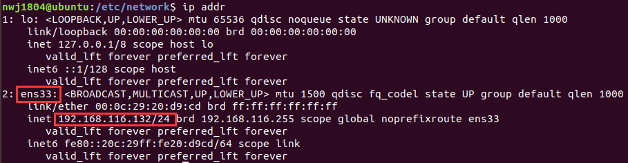

# Ubuntu18.04/20.04静态IP设置

**声明：** 不同于Ubuntu16.04，在 Ubuntu 18.04 中如果再通过原来的 `ifupdown` 工具包继续在 **`/etc/network/interfaces`** 文件里配置管理网络接口是无效的！

**Step1：** 查找`netplan`目录下默认的网络配置文件，文件后缀为`.yaml`，我的是叫`01-network-manager-all.yaml`的文件。如果没有可以使用`sudo vim 01-network-manager-all.yaml`自己创建和。

```shell
cd /etc/netplan
sudo vim 01-network-manager-all.yaml
```

**Step2：** 编辑网络配置文件`01-network-manager-all.yaml`，内容如下：

```vim
# Let NetworkManager manage all devices on this system
network:
  version: 2
  renderer: NetworkManager
  ethernets:
   ens33:  # 虚拟机的网卡名称
     dhcp4: no  # no代表不是用dhcp动态获取ip，yes代表使用dhcp动态获取ip
     addresses: [192.168.116.132/24] # 将被固定下来的静态IP以及子网掩码
     gateway4: 192.168.116.2   # 虚拟机的网关
     nameservers:  # dns地址
       addresses: [8.8.8.8, 8.8.4.4]
       search: [localdomain]  # 虚拟机所在的domain
```

**Remark：** 

查虚拟机网卡名称、子网掩码、当前IP：



查看虚拟机网关：


**Step3：** 应用

```shell
sudo netplan apply
```


