# 结题报告

## 目录

- [结题报告](#结题报告)
  - [目录](#目录)
  - [项目介绍](#项目介绍)
  - [小组成员以及分工](#小组成员以及分工)
  - [立项依据](#立项依据)
    - [项目背景](#项目背景)
    - [DisGraFS](#disgrafs)
      - [DisGraFS 中存在的问题](#disgrafs-中存在的问题)
    - [dontpanic](#dontpanic)
      - [文件编解码](#文件编解码)
    - [监控模块](#监控模块)
      - [监控的含义与价值](#监控的含义与价值)
      - [Prometheus](#prometheus)
      - [Grafana](#grafana)
  - [项目设计](#项目设计)
    - [系统架构](#系统架构)
    - [Neo4j](#neo4j)
      - [Neo4j 是什么](#neo4j-是什么)
      - [改进内容](#改进内容)
    - [计算集群](#计算集群)
      - [概述](#概述)
      - [搭建 Ray cluster](#搭建-ray-cluster)
      - [检测有新文件传到计算集群](#检测有新文件传到计算集群)
      - [打标操作](#打标操作)
      - [打标信息传给图数据库](#打标信息传给图数据库)
    - [Monitor](#monitor)
      - [Prometheus](#prometheus-1)
      - [InfluxDB](#influxdb)
      - [Grafana](#grafana-1)
      - [监控原理以及相关接口](#监控原理以及相关接口)
      - [运维对Storage节点的远程操作](#运维对storage节点的远程操作)
    - [前端美化](#前端美化)
  - [增加功能](#增加功能)
    - [前端](#前端)
      - [增加第二个图结构页面](#增加第二个图结构页面)
      - [文件操作](#文件操作)
      - [目录操作](#目录操作)
    - [Storage](#storage)
      - [碎片删除](#碎片删除)
    - [Docker](#docker)
      - [Docker 部署的意义](#docker-部署的意义)
      - [打标服务器的部署](#打标服务器的部署)
      - [存储节点的部署](#存储节点的部署)
    - [Websockets](#websockets)
    - [用户操作](#用户操作)
    - [运维操作](#运维操作)
  - [效果展示](#效果展示)
    - [用户视角](#用户视角)
    - [运维视角](#运维视角)
  - [项目总结](#项目总结)
  - [致谢](#致谢)
  - [参考文献](#参考文献)


## 项目介绍

本项目名为 **GraND Pro**，全称为 Graph Network Disk with Prometheus，带有图结构的分布式网盘，加有监控运维模块。

本项目基于 2021 年的 x-DisGraFS 展开，DisGraFS 是一个分布式图文件系统，它将图结构的思想应用到分布式文件系统上面，使之兼具图文件系统方便用户快速搜索、模糊搜索、查找相关文件的特点，以及分布式文件系统的海量文件存储、云存储的特点。不过，DisGraFS 并未实现真正的远程存储集群，它要求用户将存储节点挂载到本地，形成一个客户端，这一操作增加了用户的使用难度。我们项目参考了 2020 年 dontpanic 的高可用性分布式存储设计，搭建起完全意义上的存储集群，简化用户操作，用户对文件的上传、下载、共享等操作只需在网页端进行，无需额外配置。 此外，我们致力于设计一套带有监控模块的可运维系统，通过监控，运维工作者能够实时掌握系统的运行状态，保证服务正确稳定地运行，并且可以远程执行管理员操作。

在具体实现上，我们复用了 dontpanic 的纠删码文件切片设计，改进了多用户隔离，在网页端引入共享、删除、重命名等文件操作，引入了文件夹操作，通过 vpn 搭建 Ray 集群，引入了监控模块，监控数据图形可视化，运维工作者可以远程唤醒或关闭存储节点。用户的所有操作均在网页端进行。我们也实现了多个模块的容器化部署。

## 小组成员以及分工

- 徐奥（组长）：计算集群，Websockets
- 关浩祥：部分前端合并与美化，运维监控界面设计
- 牛午甲：监控的部署，ssh远程操作等运维相关
- 谭骏飞：增加文件和目录操作，Docker 部署，部分前端美化
- 赵子毅：维护图数据库，部分前端美化

此外，对 DisGraFS 和 dontpanic 的源码阅读与复现均由五名成员合作完成

## 立项依据

### 项目背景

在信息大爆炸的时代，人类所能够获取和存储的信息量不断增长，这对人类自身对大量信息的管理能力了更高的要求。但是，现有的基于树形结构的文件系统设计主要面向机器思维而非人类思维，这迫使人类不得不以机器的方式思考，试图将自己思维映射到树形结构上从而适应机器，从而导致人类不能按照自然的思维模式对存储的信息进行检索。在这种思维的扭曲下，分类困难、文件起名困难、找不到文件等令人头疼的问题便层出不穷。考虑到人类的思维很大程度上基于信息与信息之间的“相关性”，用图的结构来描述文件之间的关系显然比树形结构更加符合人类思维。

此外，随着社会经济的发展与信息化的进行，大量的的智能备正疯狂涌入人们的生活中。这些设备极大地提高了企业的办公效率、丰富了家庭的娱乐需求，但如何高效地利用分散在这些不同的设备上的存储空间如今正越发成为大家关注的问题：运用好这些分散的存储空间不仅可以方便多人合作，更可以避免资源的浪费。然而，传统的分布式文件系统由于缺少高性能服务器、设备在线时间不确定等原因不适用于小型私有场景，商业网盘存在收费高，限速等问题。由此，我们希望在前人的基础上，实现可用性高的、可移植性强的、基于互联网的小型分布式文件系统，在上述应用环境中提供良好的私人部署网盘服务。


然而，分布式文件系统设备众多，如何实现设备的管理、维护网盘服务器便成为了一个难题。
传统的通过日志实现系统监控的手段存在着理解困难、维护门槛高、难以实时监控、日志分散在各个设备的缺陷。因此，我们提出了在网盘的各个设备上部署分布式监控系统的设想。分布式监控是部署在分布式系统内的监控组件，可以监视和显示集群中各节点状态信息，最后将采集到的数据汇总到一个数据库，进行分析处理后以直观的图形化界面进行呈现。

结合图结构以及监控的需求，我们提出了GraND Pro的设计，一个部署有监控的分布式图结构网盘。


### DisGraFS

DisGraFS 是由 [OSH-2021 x-DisGraFS 小组](https://github.com/OSH-2021/x-DisGraFS) 构建地一个分布式图文件系统，将图结构的思想应用于分布式文件系统上面，使其兼顾图文件系统方便用户快速搜索、模糊搜索、查找相关文件的特点，以及分布式文件系统的海量文件存储、云存储的特点。

#### DisGraFS 中存在的问题

1. DisGraFS 的远程存储集群实际没有实现。按照 DisGraFS 本来的设想，当整个分布式文件系统搭建运行起来以后，用户只需要进入到 DisGraFS 提供的网页，登陆验证通过后，即可看到整个图文件系统，并在网页上实现文件的上传、移动和删除。而 DisGraFS 在具体实现中，为了简化工作量（工作量确实非常大），DisGraFS 小组将远程存储节点进行了简化，远程存储集群的 Redis 数据库仅有一台服务器，而用户需要将这个存储集群挂载到本地，才能实现文件的传输。我们致力于完成他们最初的设想，重新搭建存储集群，这将是一个真正具有多个存储节点的、远程的集群，用户的所有操作仅需要在网页端执行。
2. DisGraFS 并不具备可运维性，也没有进行可用性的保障，它的日志文件分散，开发人员很难同时获得整个系统的运行状态，也很难看到各个节点的资源使用情况，甚至无法及时了解某个物理节点是否还处于连接状态，这使得它的可用性不能得到保证。这也是我们要搭建监控组件的原因。

### dontpanic

#### 文件编解码

dontpanic 采用纠删码技术中的里德-所罗门算法（Reed-Solomon Code）对文件进行冗余，使用柯西矩阵作为编码矩阵。该项目参考 [Go 语言的实现的 RS 纠删码项目](https://github.com/klauspost/reedsolomon)，编写了 Go 语言代码并编译成 WebAssembly 格式，用于网页端实现文件切片和编解码。

### 监控模块

#### 监控的含义与价值

分布式监控是部署在分布式系统内的监控组件，它可以监视和显示集群中各节点的状态信息，它有运行在各个节点的进程，可以采集不同节点之间的通信消息，采集各个节点的资源利用率，最后将采集到的数据汇总到一个数据库，进行分析处理后以直观的图形化界面进行呈现。

#### Prometheus

Prometheus 是一个开源系统监控和警报工具包，它将实时的指标数据（metrics）记录并存储在通过 Http 拉取模型构建的时间序列数据库中，有着较灵活的询问功能和实时告警功能。

#### Grafana

Grafana 是一个跨平台的开源的度量分析和可视化工具，可以通过将采集的数据查询然后可视化的展示，并及时通知。

## 项目设计

### 系统架构


本项目共分为六个模块，分别是：

+ 索引服务器：与存储集群交互，获取存储节点的状态信息

+ 图数据库：维护存储文件的图结构

+ 分布式存储集群：文件切片后的存储位置

+ 分布式计算集群：由 Ray 支持的打标计算集群

+ 分布式监控：监控各模块状态、资源占用情况，可远程唤醒与关闭存储节点

+ 网页端：呈现给用户的界面，用户可进行文件或文件夹操作，查看图结构

### Neo4j

#### Neo4j 是什么

图数据库（graph database）是一个使用图结构进行查询的数据库，使用节点、边和属性来表示和存储数据。该系统的关键概念是图，它直接将存储中的数据项，与数据节点和节点间表示关系的边的集合相关联。这些关系允许直接将存储区中的数据链接在一起，并且在许多情况下，可以通过一个操作进行检索。

Neo4j 是一个高性能的 NOSQL 图形数据库。Neo4j基于其特殊的储存结构与Cypher 查询语言，设计并优化了多种图上的算法，使得查询、插入、删除等图操作的效率大大提高。我们使用 neo4j 来进行对图数据库的管理，根据标签与结点的相邻关系来进行检索，充分发挥图数据库的优势，提升文件索引的效率。

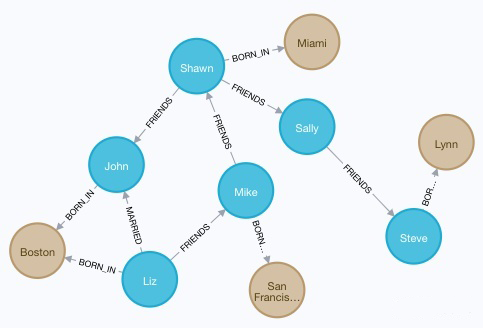

#### 改进内容

1. 同名不同类型之间文件的关联：
   
    DisGraFS的FILE节点只具有name和size两个有效属性,创建标签时除了来自打标的标签，还会新建一个与文件name同名的标签，可见他们也有实现这个功能的想法，但是出于种种原因未能实现。我们完成了这一点。
   
    我们将name拆分为name和ext，即将文件的名字和其拓展名拆分开，这使不同类型但同名文件之间的关联变得有可能（如ipadpro.pdf与ipadpro.png）
   
    创建与filename同名标签时 首先查询有无同名标签，若无则创建，有则跳过。然后新建关系时创建标签与文件关系即可。

2. 对路径操作的支持：
   
    DisGraFS的文件系统中虽然有目录结构，但是各个目录在neo4j中是一视同仁的，不能区分不同路径的同名文件。
   
    我们在图节点中新增了path属性，用于标识每一个文件的路径。支持了删除文件夹和重命名文件夹等路径操作。删除文件夹时通过正则匹配path属性，将path带有该前缀的节点全部删除，并适当删除孤立标签。重命名同理，通过字符串操作重新设置path属性即可。

3. 对多用户的支持：
   
    DisGraFS所有用户共享一个网盘。
   
    我们对所有节点，包括FILE和LABEL都添加了owner属性，标识该文件的所有者。在使用GraND Pro的过程中，用户的操作在图数据库里只涉及到修改自己的节点和关系。我们对前端页面查看同样做了隔离，使得所有用户都只能看到自己所有的文件和标签，从而实现GraND Pro对多用户的支持。

4. 支持更多操作：
   
    支持对文件进行删除，重命名，支持共享文件给其他用户。

5. 更高的执行效率：
   
    改进代码结构，使用更高效率的cypher查询语言命令。我们通过重新安排python代码结构及其与cypher查询语言之间的配合，提高了图数据库操作的执行效率。

### 计算集群

#### 概述


用户上传的文件，除了被切片编码发送到存储集群以外，还需要复制一份传到计算集群，计算集群检测到有新文件上传，就会执行打标操作，打标结果传给图数据库。

计算功能由 Ray cluster 支持。Ray 是一个分布式高性能计算框架，遵循了典型的 Master-Slave 的设计，Master 负责全局协调和状态维护；Slave 执行分布式计算任务。不过和传统的分布式计算系统不同的是 Ray 使用了混合任务调度的思路。

当有多个文件同时上传时，文件的打标请求会先放入任务队列，然后依次由 Ray 集群执行，Ray 为每个 Task 分配 worker，实现并行处理、负载均衡。

打标结束后，删除被打标文件。

#### 搭建 Ray cluster

Ray 的搭建需要所有节点在同一局域网内，而 Ray 的 head 节点需要保持运行，才能保证其他 worker 节点的连接，所以我们把 head 节点部署在一台服务器上，worker 节点目前位于我们本地电脑的虚拟机。局域网的实现是通过搭建 vpn，将本地接到服务器的内网。

#### 检测有新文件传到计算集群

文件接收使用 Websockets，这里使用的接收代码是更改了 dontpanic 的 client 节点的文件接收代码实现的。收到的文件存放到固定的目录下。检测由 watchdog 执行，每检测到新文件上传，就会将文件信息加入任务队列。

#### 打标操作

复用了 DisGraFS 的打标代码

#### 打标信息传给图数据库

使用到了 asyncio 库，协程遇到 IO 操作而阻塞时，立即切换到别的任务，如果操作完成则进行回调返回执行结果。实现并发执行。

### Monitor

本项目采用Prometheus+influxDB+Grafana进行了对存储节点、计算节点的指标监控。本项目的监控逻辑如下图所示：

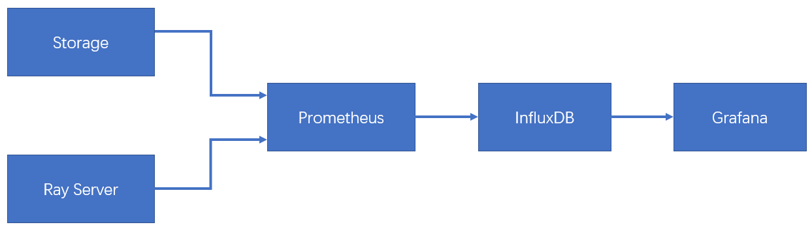

#### Prometheus

Prometheus 是一个开源系统监控和警报工具包，它将实时的指标数据（metrics）记录并存储在通过 Http 拉取模型构建的时间序列数据库中，有着较灵活的询问功能和实时告警功能。

Prometheus 的整体架构以及生态系统组件如下图所示：


在本项目中，使用到了Prometheus server、pushgateway、node_exporter：

- Prometheus Server 直接从监控目标中或者间接通过推送网关来拉取监控指标，它在本地存储所有抓取到的样本数据，并对此数据执行一系列规则，以汇总和记录现有数据的新时间序列或生成告警。

- Pushgateway 用于暂时存放 Prometheus 来不及处理的 Job 中的数据，防止监控数据丢失。本项目中用pushgateway监控在线storage节点个数，以及storage节点的剩余容量。

- 为了能够采集到Ray server和storage节点的运行指标如 CPU, 内存，磁盘等信息，我们使用 Node Exporter。

#### InfluxDB

Prometheus Server 本身就是一个时序数据库，将采集到的监控数据按照时间序列的方式存储在本地磁盘当中。但是本地存储也意味着 Prometheus 无法持久化数据，无法存储大量历史数据，同时也无法灵活扩展和迁移。InfluxDB 是一个由 InfluxData 开发的开源时序型数据库，着力于高性能地查询与存储时序型数据，在DB-Engines Ranking时序型数据库排行榜上排名第一，广泛应用于DevOps监控、IoT监控、实时分析等场景。

#### Grafana

Grafana是一个跨平台的开源的度量分析和可视化工具，可以通过将采集的数据查询然后可视化的展示，并及时通知。它主要有以下六大特点：

- 展示方式：快速灵活的客户端图表，面板插件有许多不同方式的可视化指标和日志，官方库中具有丰富的仪表盘插件，比如热图、折线图、图表等多种展示方式；

- 数据源：Graphite，InfluxDB，OpenTSDB，Prometheus，Elasticsearch，CloudWatch和KairosDB等，本项目中使用了InfluxDB

- 通知提醒：以可视方式定义最重要指标的警报规则，Grafana将不断计算并发送通知，在数据达到阈值时通过Slack、PagerDuty等获得通知；

- 混合展示：在同一图表中混合使用不同的数据源，可以基于每个查询指定数据源，甚至自定义数据源；

- 注释：使用来自不同数据源的丰富事件注释图表，将鼠标悬停在事件上会显示完整的事件元数据和标记；

- 过滤器：Ad-hoc过滤器允许动态创建新的键/值过滤器，这些过滤器会自动应用于使用该数据源的所有查询。

#### 监控原理以及相关接口

Ray Server以及Storage通过node_exporter和pushgateway把节点资源使用的相关指标提交给Prometheus server，Prometheus server可以使用PromQL实时查询监控数据。关于自定义指标的监控，Storage server通过将mysql中的相关信息push到Prometheus server以实现Prometheus对storage的监控。Prometheus server自带时序数据库以及监控指标的图形化展示，但是监控数据存储在本地很不方便。因此使用influxDB存储监控数据以便数据存储和迁移。Prometheus server定义了两个标准接口 (remote_write/remote_read)，让用户可以基于这两个接口对接将数据保存到任意第三方的存储服务中。本项目使用了Prometheus官方提供的开源写适配器插件Remote storage adapter，配置go环境后编译组件即可使用。只需在Grafana中配置influxDB的数据源即可将数据库中的监控指标相关信息用图形化展示出来。

#### 运维对Storage节点的远程操作

- 远程唤醒
  
  首先建立运维和Storage的远程连接：利用python中的Paramiko模块直接使用SSH协议对远程Storage节点执行操作。在操作过程中要注意每次命令执行后都会自动回到根目录下，造成`cd`命令无效的“假象“。因此必要时需要一次执行多条命令以确保执行的操作完整有效。

- 远程终止
  
  在远程操作时，`Ctrl+C`和`Ctrl+Z`显然不能起到有效终止进程的作用，因此需要获得Storage节点对应进程的pid，远程kill进程。

### 前端美化

登录界面使用基于 bootstrap 5 的 [MDB](https://mdbootstrap.com/docs/standard/) 登陆界面进行美化，登录界面与注册界面淡入淡出式切换，边框圆角化设计


网盘界面使用开源框架[Hendrix](http://www.bootstrapmb.com/item/10834) 将其与x-dontpanic的主页面整合

具体改进如下：

1. 增加页面内标题x-TOBEDONE
2. 增加背景图片，增加图片上的轮换滚动字体
3. 项目名字字体样式改进，增加渐变色
4. 各按钮美化

效果展示如下：


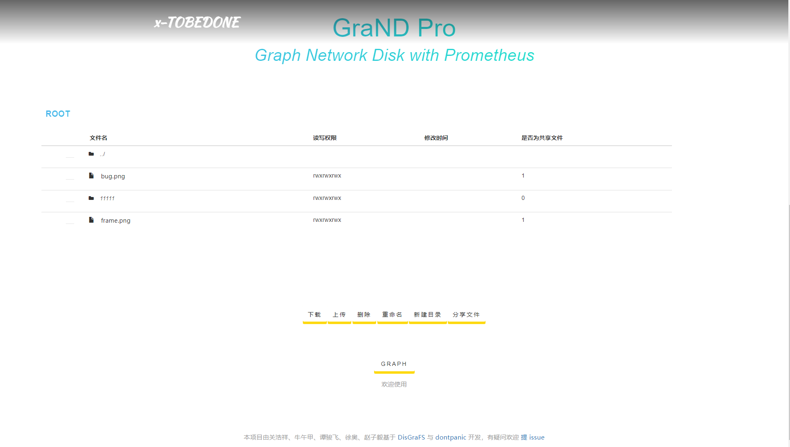

## 增加功能

### 前端

#### 增加第二个图结构页面

考虑到原来的图界面是用于知道标签之后有目的性地进行筛选的操作界面，不利于用户把握整个文件系统的图结构，我们引入了基于neovis.js框架的第二个界面

该界面功能与neo4j官方提供的管理员界面类似，能看到所有文件和标签以及它们之间的关系

效果如下所示：

<div style="text-align:center">
  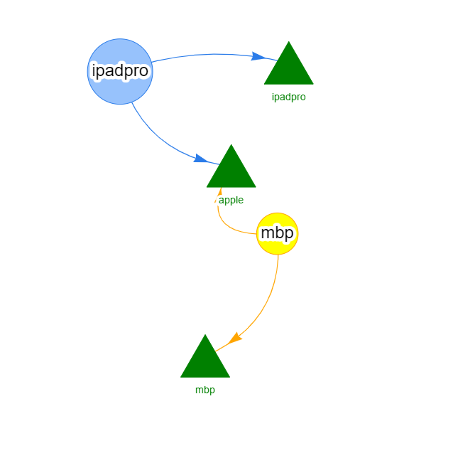
</div>


#### 文件操作

文件操作增加了文件删除、重命名和共享功能。

- 文件删除时，网页端分别通过 WebSocket 和 ajax 向图数据库和后端发送文件删除请求，以在 Neo4j 和 MySQL 删除相应的文件条目；
- 文件重命名时，网页端也采取类似方法通知 MySQL 和 Neo4j 完成文件的重命名。        
- 文件可以由一个用户共享给指定的用户，被分享的用户可以在根目录下看到被分享的文件，并可以下载和删除共享文件。文件共享的大致逻辑为：在 MySQL 里的 DFS.FILE 表内新增 ISSHARE 列，以表示该文件是否为共享文件，所有共享文件共用同一批文件碎片；当用户将主文件共享出去时，相当于给该文件创建了一个副本，只删除文件的副本并不会影响主文件、其他副本和删除文件碎片；删除主文件则会删除该文件的所有副本并删除文件碎片。所有涉及文件共享的更改也会同步到 Neo4j 图数据库上。

#### 目录操作

目录增加了目录新建、删除和重命名的功能。MySQL 数据库中目录和文件同处于 DFS.FILE 数据表，通过 ISFOLDER 列的值进行区分。

- 目录在删除时会同时在 MySQL 和 Neo4j 中删除目录下的子目录和文件的条目，同时在存储节点内删除其碎片
- 目录重命名时也会在 MySQL 和 Neo4j 更新目录下子目录和文件的路径信息

### Storage

#### 碎片删除

用户在网页端执行删除指令后，既需要在 mysql 数据库中删除文件信息，也需要在存储节点删除对应的文件碎片，以保证避免残余碎片产生的资源浪费，更好地利用存储节点的存储资源。

碎片删除是一个远程操作。在用户发出文件删除请求时，网页端在通知后端删除文件的同时将要删除的碎片和碎片所在的存储节点 ID 通过 Websocket 发给索引服务器，后者通过 SSH 删除在相应 存储节点上存储的文件碎片，从而实现资源的回收。

### Docker

#### Docker 部署的意义

Docker 是一个开源的应用容器引擎，让开发者可以打包他们的应用以及依赖包到一个可移植的容器中，然后发布到任何流行的 Linux 机器上，也可以实现虚拟化。

使用 Docker 部署有以下的优势： 

首先，Docker的使用简单至极，从开发的角度来看就是三步走：构建，运输，运行。其中关键步骤就是构建环节，即打包镜像文件。但是从测试和运维的角度来看，那就只有两步：复制，运行。有了这个镜像，那么想复制到哪运行都可以，完全和平台无关了。同时Docker这种容器技术隔离出了独立的运行空间，不会和其他应用争用系统资源，且不需要考虑应用之间的相互影响。

其次，因为在构建镜像的时候就处理完了服务程序对于系统的所有依赖，所以在你使用的时候，你可以忽略掉原本程序的依赖以及开发语言。对测试和运维而言，更多专注于自己的业务内容上。

最后，Docker于开发者而言提供了一种开发环境的管理办法，与测试人员而言保证了环境的同步，于运维人员提供了可移植的标准化部署流程。

#### 打标服务器的部署

由于打标服务器的部署相对复杂，需要安装大量的库，因此我们实现了打标服务器的 Docker 部署。

相关的 Dockerfile 如下：

```dockerfile
FROM ubuntu

ENV DEBIAN_FRONTEND noninteractive

WORKDIR /

COPY . /

RUN sed -i s/archive.ubuntu.com/mirrors.aliyun.com/g /etc/apt/sources.list &&\
    sed -i s/security.ubuntu.com/mirrors.aliyun.com/g /etc/apt/sources.list &&\
    apt-get update
    # 换用国内的源

RUN apt install -y python3 && apt install -y python3-pip
RUN apt-get install -y gcc && apt-get install -y wget && apt-get install -y git
    # 安装相关的编译环境
RUN pip3 config set global.index-url https://pypi.tuna.tsinghua.edu.cn/simple &&\
    pip3 install -r requirements.txt && \
    pip3 install -U ray
    # 下载依赖的包

RUN python3 -m nltk.downloader stopwords
RUN python3 -m spacy download en
RUN python3 -m nltk.downloader universal_tagset
RUN cd pke && python3 setup.py install && cd ..
RUN cp -r ./pke /usr/local/lib/python3.10/dist-packages/pke/
```

根据该文件创建镜像并启动容器后，在容器内启动 ray 的头结点和相关 Python 文件后，打标服务器即可正常运行。

#### 存储节点的部署

为了方便存储端的部署，我们也实现了存储节点的容器化部署，附上相关的 Dockerfile：

```dockerfile
FROM java:8-jdk-alpine

COPY . /

RUN mkdir c1 # 这里的目录名要与 setup.ini 中存碎片的目录相一致

CMD ["java", "-jar", "client.jar"]
```

### Websockets

这里的 Websockets 特指传输文件的 Websockets，它是由 dontpanic 组实现的，不过当单词传输文件超过 20KB 后，传输就会出错。这里的原理与本课程的多人聊天室相同，问题出在 send 和 recv 操作可能一次无法全部传完，在具体代码中，体现在 read 函数，改进方法也与多人聊天室的设计思路相同，根据 read 的返回值是否与待接收消息长度相同，判断一次 read 是否真正完成。

### 用户操作

登录注册界面：用户在该界面进行注册与登录操作

网盘界面：用户在该界面从本机文件中选择文件进行上传，对于网盘中的文件可进行删除、重命名、共享等操作，还可创建文件夹并切换路径

GRAPHW：用户在该界面查看网盘系统中的所有文件构成的关系图，通过文件间相连的 label 进行文件间关系的获取

GRAPHS：用户在该界面根据 label 进行文件的查找，支持文件 label 的与关系，也可获取图数据库的可视化样式，还可对检索出的文件进行删除、重命名等操作

### 运维操作

Storage server和Ray server启动之后，运维远程唤醒Storage节点，启动监控相关程序将监控指标格式化为可用PromQL查询的形式，再push到Prometheus server，然后登录运维界面查看监控指标。具体操作参见效果展示的运维视角。

## 效果展示

### 用户视角

首先通过 http://43.142.97.10:8080/grandpro_2022/ 进入到注册登录界面，输入用户名与密码进行注册与登录


然后进入用户网盘界面，在这里，用户可以选择上传、下载、重命名、删除文件以及创建文件夹并切换路径，还可进入图数据库的可视化界面

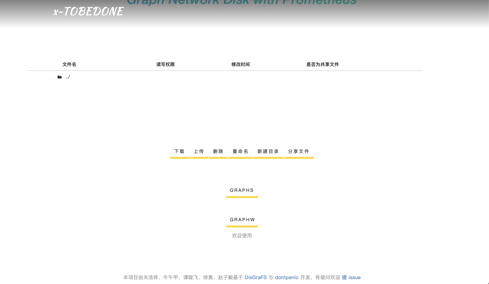

GRAPHW 是用户所拥有的文件的关系总图，利用文件的 label 可直观看出文件之间的关系：

<div style="text-align:center">
  
</div>

GRAPHS 提供用户基于可视化图数据库的文件检索界面，可以根据文件的 label 可视化查找文件，同时也提供文件删除重命名等各种文件基本功能，也是图数据库可视化的另一样式

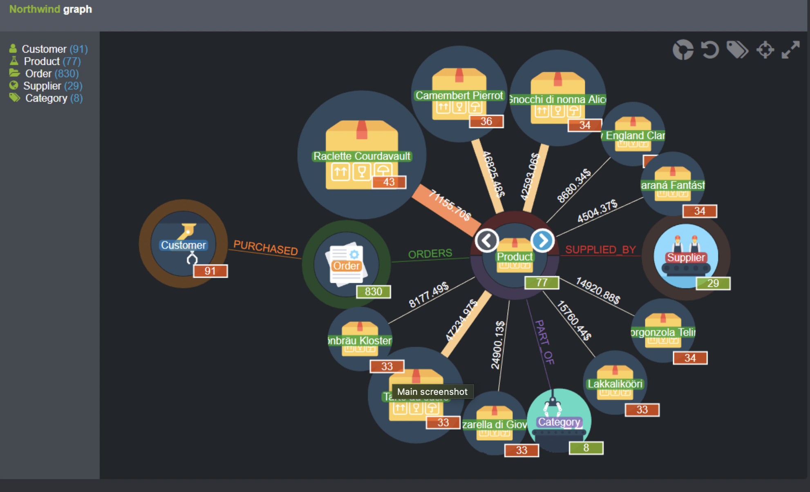

### 运维视角

首先`pyssh.py` 远程唤醒Storage节点，启动监控相关的程序`device_leftrs.py` `online_device_count.py`将监控指标格式化，再启动`push.py` 将监控指标push到Prometheus server，然后登录运维web端：

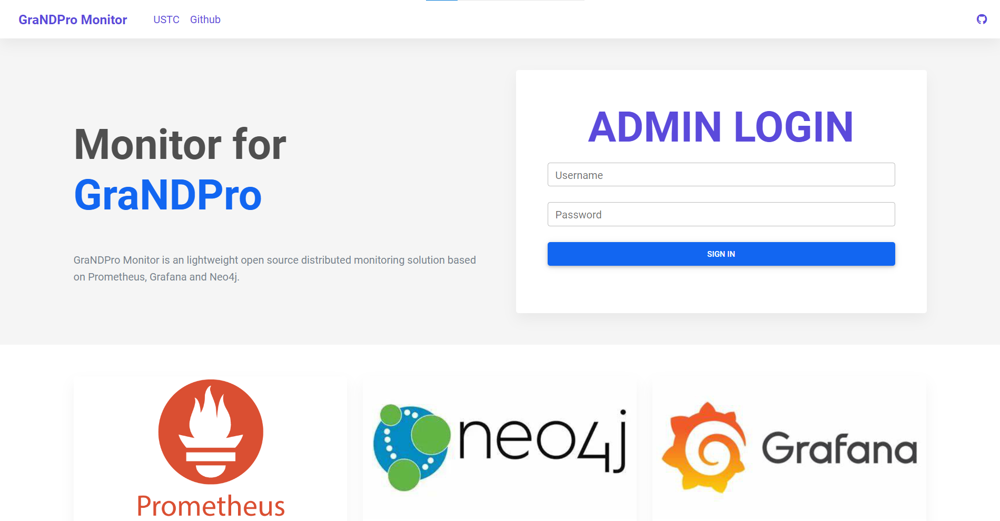

进入登录后界面：

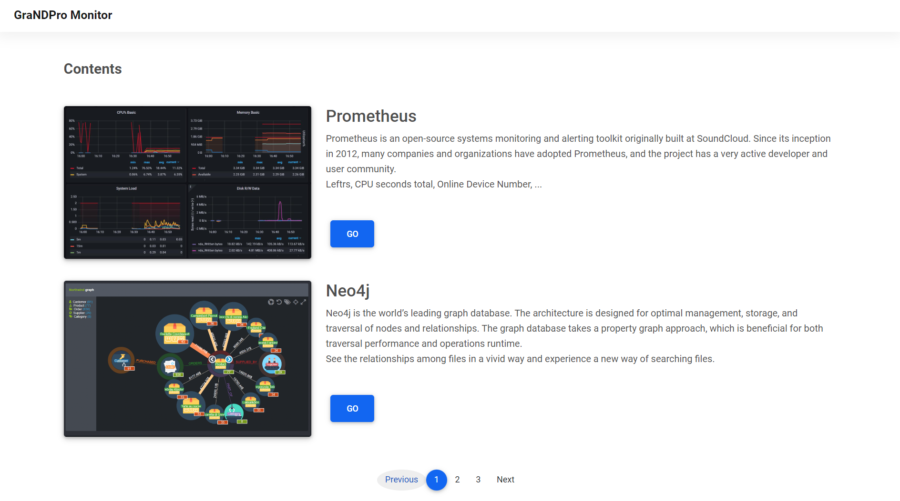

查看监控指标：

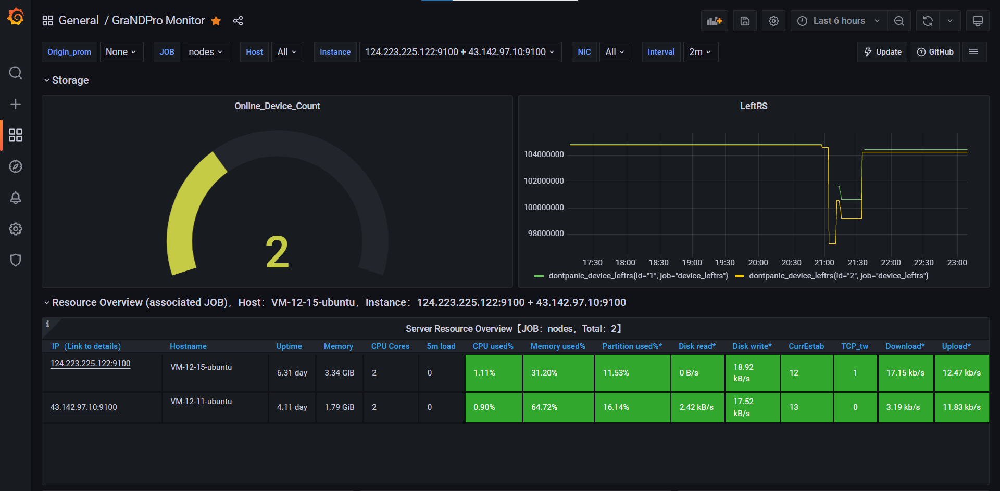

查看图数据库相关信息：

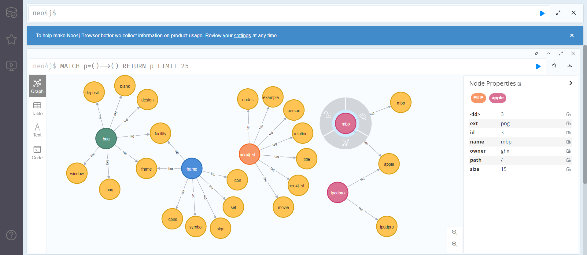

## 项目总结

本项目是在过去五年的几个 OSH 项目基础上优化发展而来的。

<div style="text-align:center">
  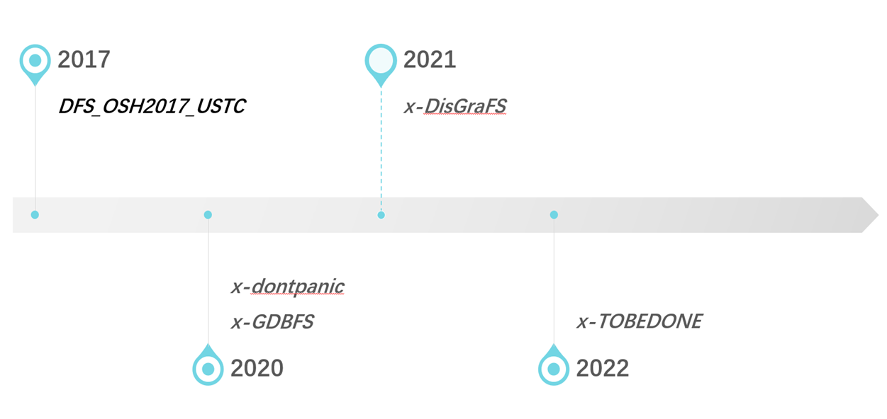
</div>

时间线的源头是 2017年的 DFS，它实现了分布式网盘，以及用户管理功能，它的网盘是共享网盘，所有登陆上的用户用的是同一个网盘。 2020 年的 dontpanic 项目是在 DFS 基础上做的优化提升，dontpanic 改进了 DFS 的纠删码，实现了更高效率的编解码，增加了初步的用户隔离操作，文件传输不再经过中央节点，而是网页端与 storage 直接传输，2020年的另一个项目 GBDFS，是基于数据库文件系统，将数据库文件系统改进成为了图数据库文件系统。2021年的 DisGraFS 项目受到 DFS 和 GBDFS 启发，提出了分布式图文件系统，只是在具体实现时没有做到分布式存储，时间线来到了 2022 年，我们组基于 DisGraFS，实现了远程分布式存储集群，简化了用户操作，新增了一些网页端功能，引入了监控运维模块。

通观这条时间线，我们认为，这是一种传承。我们总是在前人的基础上不断改进优化、推陈出新，一步一步让这个系统更加丰富、更加完善。

## 致谢

邢凯老师参与了本小组选题与项目设计各个阶段的大量讨论，并在项目设计的部分细节、小组合作、项目汇报等方面为我们提供了许多启发性的建议与无私帮助。

DisGraFS 和 dontpanic 的学长学姐在我们复现时提供了大量帮助，他们的项目为我们提供了很多启发与经验。

本课程明宇龙等几位助教提出了很多的优质建议。

在此本小组成员一并表示感谢。

## 参考文献

https://www.zhihu.com/question/53936892

https://tech.ipalfish.com/blog/2020/07/21/tidb_monitor/

https://tech.meituan.com/2018/11/01/cat-in-depth-java-application-monitoring.html

https://tech.meituan.com/2018/11/01/cat-pr.html

[OSH-2021/x-DisGraFS: Distributed Graph Filesystem (github.com)](https://github.com/OSH-2021/x-DisGraFS)

[OSH-2020/x-dontpanic: team dontpanic in ustc-osh-2020 (github.com)](https://github.com/OSH-2020/x-dontpanic)

[neo4j cypher authority](https://neo4j.com/developer/cypher/)

[neo4j cpyher detail](https://blog.csdn.net/qq_46092061/article/details/117855018)

