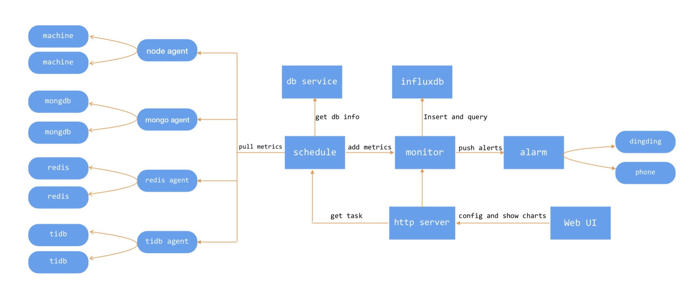

# 调研报告

## 小组成员

徐奥 谭骏飞 关浩祥 赵子毅 牛午甲

## 目录

+ [调研报告](#调研报告)
  + [小组成员](#小组成员)
  + [目录](#目录)
  + [项目概述](#项目概述)
  + [项目背景](#项目背景)
  + [立项依据](#立项依据)
  + [前瞻性/重要性分析](#前瞻性/重要性分析)
  + [相关工作](#相关工作)
  + [参考文献](#参考文献)

## 项目概述

本项目基于 2021 年 OSH 项目 DisGraFS 展开。DisGraFS 是一个分布式图文件系统，该项目学习总结了当今主流几个分布式文件系统的优点，并且将文件标签与图结构联系起来描述文件之间的关系，统一了单机文件系统和分布式系统的优点。该项目将图结构与思想应用于分布式文件系统上面，使得分布式图文件系统兼具图文件系统方便用户快速搜索、模糊搜索、查找相关文件的特点以及分布式文件系统的海量文件存储、云存储的特点。

一个完善的分布式系统需要具有监控组件，本项目将致力于在 DisGraFS 上安装分布式监控系统，实现对计算节点和存储节点之间通信的实时监控，从内部的运行细节出发，自内而外掌握系统的状态，保证系统和服务的正常运行。

## 项目背景

### 分布式文件系统

​	文件系统，是操作系统用于明确磁盘或分区上的文件的方法和数据结构，是在磁盘上组织文件的方法，是操作系统中负责管理和存储文件信息的软件机构。它由三部分组成：与文件管理有关的软件、被管理的文件以及实施文件管理所需要的数据结构。

​	分布式文件系统，是分布在多个文件服务器或者多个位置上的文件系统，即将对文件的操作由单机转向分布式存储集群。它具有执行远程文件存取的能力，并以透明方式对分布在集群中的文件进行管理和存取。

### 图数据库

​	图数据库用图来存储数据，是最接近高性能的一种用于存储数据的数据结构方式之一。

​	图数据库（graph database）是一个使用图结构进行查询的数据库，它使用节点、边和属性来表示和存储数据。该系统的关键概念是图，它直接将存储中的数据项，与数据节点和节点间表示关系的边的集合相关联。这些关系允许直接将存储区中的数据链接在一起，并且在许多情况下，可以通过一个操作进行检索。图数据库将数据之间的关系作为优先级。查询图数据库中的关系很快，因为它们永久存储在数据库本身中。可以使用图数据库直观地显示关系，使其对于高度互连的数据非常有用。

### DisGraFS

**基本概念**

+ 图文件系统：逻辑上抛弃树状结构，文件之间用”关系“连接。基于语义的局部性：有共同特征的文件相连
+ 分布式图文件系统：底层存储采用分布式存储，语义识别采用分布式计算，用图结构描述文件之间的关系

**系统架构**

DisGraFS分为5个组成部分：索引服务器、分布式存储集群、分布式计算集群、网页端和客户端。

- 索引服务器：进行分布式存储集群与分布式计算集群的通信、网页端部署的位置，目前也负责构建与维护图数据库（但若有需要，也可将图数据库的部分分离出去）；
- 分布式存储集群：基于 Juicefs 的分布式储存系统，管理、存储和调度分布式存储系统中的所有文件；
- 分布式计算集群：基于 Ray 的分布式计算系统，将文本语义识别、图像识别、语音识别以及元数据提取等任务分散给计算集群中的多个计算机；
- 网页端：直观显示文件所构成的图，并将用户在图上的操作以友好方式展示。
- 客户端：客户端负责直接接收用户对文件系统的操作，并针对不同的平台对其进行实现。

**具体技术**

> 分布式存储集群：JUICEFS + 阿里云 OSS
>
> 图数据库：NEO4J
>
> 网页前端：使用 neo4j 官方提供的 d3.js 和 pototo.js 框架
>
> 文件语义识别
>
> 分布式计算集群：RAY + VLAB

**操作**

  **新增文件**

1. 用户在网页端启动客户端，将分布式存储集群挂载在本地电脑上；
2. 用户将需要上传的文件直接拖入 JuiceFS 对应的盘，此时分布式存储系统对文件进行切分并通过合理调度将文件分布式地存储在存储集群中；
3. 分布式存储集群发信息给索引服务器，索引服务器将信息转发给分布式计算集群，开始对文件进行内容识别并且打出标签；
4. 打标完成后，分布式计算集群将标签以及文件其他信息一起发送返回给索引服务器，索引服务器根据收到的标签以及文件信息更新图数据库。

  **文件搜索**

1. 用户在网页端提出文件搜索请求，网页端将搜索关键字（可以是标签，也可以是文件名）上传至索引服务器；
2. 索引服务器根据关键字创建搜索语句，在图数据库中搜索，将具有相关标签的所有文件通过图和列表两种方式返回至网页端；
3. 用户可以根据网页端返回的图，直接通过点击获得某一文件的标签与信息，或者获得具有某一标签的所有文件，实现根据文件内容进行搜索以及在图上直接搜索邻顶的目标。

  **文件获取**

1. 用户在关键词搜索返回的文件中找到自己需要的文件，点击打开文件的按键，服务器将消息传给 JuiceFS 分布式存储集群；
2. 分布式存储集群找到需要打开的文件，将其下载到用户本地存储空间并将其打开。

  **删除文件**

1. 用户在客户端提出删除文件的请求，客户端将目标文件名上传至索引服务器；
2. 索引服务器将信息传递给分布式存储集群，分布式存储集群将文件删除；
3. 索引服务器根据文件名删除图数据库中对应的节点，更新图数据库。

### 监控系统

​	监控系统的功能主要包括：对服务、系统、平台运行状态实时监控，收集运行信息，分析结果并预知存在的故障风险，一旦发生故障需要第一时间发出告警信息，监控数据可视化，最终保证系统持续、稳定、安全运行。

### Prometheus

​	Prometheus 是一个开源系统监控和警报工具包，它将实时的指标数据（metrics）记录并存储在通过 Http 拉取模型构建的时间序列数据库中，有着较灵活的询问功能和实时告警功能。

​	**优势**

1. 基于 Prometheus 丰富的 Client 库，用户可以轻松地在应用程序中添加对 Prometheus 的支持，从而让用户可以获取服务和应用内部真正的运行状态

2. 强大的数据模型

   所有采集的监控数据均以指标（metric）的形式保存在内置的时间序列数据库（TSDB）当中，所有的样本除了基本的指标名称外，还包含一组用于描述该样本特征的标签

3. 高效：对于单一 Prometheus Server 示例而言它可以处理数以百万的监控指标，每秒处理数十万的数据点。它拥有强大的查询语言 PromQL。不依赖分布式存储；单个服务节点具有自治能力。时间序列数据是服务端通过 HTTP 协议主动拉取获得的。支持多种类型的图表和仪表盘。

​    **组件**

+ Prometheus Server 作为服务端，用来存储时间序列数据。

+ 客户端库用来检测应用程序代码。

+ 用于支持临时任务的推送网关。

+ Exporter 用来监控 HAProxy，StatsD，Graphite 等特殊的监控目标，并向 Prometheus 提供标准格式的监控样本数据。

+ alartmanager 用来处理告警。

​    其中大多数组件都是用 Go 编写的，因此很容易构建和部署为静态二进制文件。

​    **Prometheus 的架构**

​	Prometheus 的整体架构以及生态系统组件如下图所示：

Prometheus Server 直接从监控目标中或者间接通过推送网关来拉取监控指标，它在本地存储所有抓取到的样本数据，并对此数据执行一系列规则，以汇总和记录现有数据的新时间序列或生成告警。可以通过 Grafana 或者其他工具来实现监控数据的可视化。

**工作原理**

​	Prometheus 所有采集的监控数据均以指标（metric）的形式保存在内置的时间序列数据库当中（TSDB）：属于同一指标名称，同一标签集合的、有时间戳标记的数据流。除了存储的时间序列，Prometheus 还可以根据查询请求产生临时的、衍生的时间序列作为返回结果。

​	在 Prometheus 的架构设计中，Prometheus Server 主要负责数据的收集，存储并且对外提供数据查询支持，而实际的监控样本数据的收集则是由 Exporter 完成。因此为了能够监控到某些东西，如主机的 CPU 使用率，我们需要使用到 Exporter。Prometheus 周期性的从 Exporter 暴露的 HTTP 服务地址（通常是 /metrics）拉取监控样本数据。

​	Exporter 可以是一个相对开放的概念，其可以是一个独立运行的程序独立于监控目标以外，也可以是直接内置在监控目标中。只要能够向 Prometheus 提供标准格式的监控样本数据即可。

​	为了能够采集到主机的运行指标如 CPU, 内存，磁盘等信息。我们可以使用 Node Exporter。

### Grafana

​	Prometheus 中的 Graph 面板可查询数据形成图表。但是缺点也很明显，这些查询结果都是临时的，无法持久化的，更别说我们想实时关注某些特定监控指标的变化趋势。

​	为了简化这些问题 Prometheus 内置了一个简单的解决方案 `Console Template` ,它允许用户通过 Go 模板语言创建任意的控制台界面，并且通过 Prometheus Server 对外提供访问路径。

Console Teamplet 虽然能满足一定的可视化需求，但是也仅仅是对 Prometheus 的基本能力的补充。同时使用也会有许多问题，首先用户需要学习和了解 Go Template 模板语言，其它其支持的可视化图表类型也非常有限，最后其管理也有一定的成本。而 Grafana 则可以让我们以更简单的方式创建更加精美的可视化报表。

### InfluxDB

​	Prometheus Server 本身就是一个时序数据库，将采集到的监控数据按照时间序列的方式存储在本地磁盘当中。Prometheus 的本地存储设计可以减少其自身运维和管理的复杂度，同时能够满足大部分用户监控规模的需求。但是本地存储也意味着 Prometheus 无法持久化数据，无法存储大量历史数据，同时也无法灵活扩展和迁移。

​	为了保持 Prometheus 的简单性，Prometheus 并没有尝试在自身中解决以上问题，而是通过定义两个标准接口 (remote_write/remote_read)，让用户可以基于这两个接口对接将数据保存到任意第三方的存储服务中，这种方式在 Promthues 中称为Remote Storage 。

​	其中 InfluxDB 时序数据库是较为常见的选择。

​	InfluxDB 是一个由 InfluxData 开发的开源时序型数据库，着力于高性能地查询与存储时序型数据，在DB-Engines Ranking时序型数据库排行榜上排名第一，广泛应用于DevOps监控、IoT监控、实时分析等场景。

​	它自带各种特殊函数如求标准差，随机取样数据，统计数据变化比等，使数据统计和实时分析变得十分方便，适合用于包括DevOps监控，应用程序指标，物联网传感器数据和实时分析的后端存储。

​	**特点**

1. 为时间序列数据专门编写的自定义高性能数据存储。 TSM引擎具有**高性能**的写入和数据压缩
2. 无系统环境依赖，部署方便。
3. 无结构化（SchemaLess）的数据模型，灵活强大。
4. 提供简单、高性能的写入、查询 http api，Native HTTP API, 内置http支持，使用http读写
5. 强大的类SQL查询语句的操作接口，学习成本低，上手快。
6. 丰富的权限管理功能，精细到“表”级别。
7. 丰富的时效管理功能，自动删除过期数据，自定义删除指标数据。
8. 低成本存储，采样时序数据，压缩存储。
9. 丰富的聚合函数，支持AVG、SUM、MAX、MIN等聚合函数。

### OpenResty

​	OpenResty 是一个基于 NGNIX 的可伸缩的 Web 平台。它是一个强大的 Web 应用服务器，Web 开发人员可以使用 Lua 脚本语言调动 Nginx 支持的各种 C 以及 Lua 模块，更主要的是性能方面，OpenResty 可以快速构造出足以胜任 10K 以上并发连接响应的超高性能 Web 应用系统

​	Nginx 采用的是 `master-worker` 模型，也就是一个 `master` 进程管理多个 `worker` 进程，基本的时间处理都放在 `worker` 进程中，`master` 进程负责全局初始化以及对 `worker` 进行的管理。

​	OpenResty 中，每个 `worker` 进程使用一个 LuaVM，当请求被分配到 `worker` 时，将在这个 LuaVM 中创建一个 `coroutine` 协程，协程之间数据隔离，每个协程都具有独立的全局变量。

### Lua

​	Lua 在葡萄牙语里代表美丽的月亮。事实证明她没有糟蹋这个优美的单词，Lua 语言正如它名字所预示的那样成长为一门简洁、优雅且富有乐趣的语言。Lua 从一开始就是作为一门方便嵌入(其它应用程序)并可扩展的轻量级脚本语言来设计的，因此它一直遵从着简单、小巧、可移植、快速的原则，官方实现完全采用 ANSI C 编写，能以 C 程序库的形式嵌入到宿主程序中。LuaJIT 2 和标准 Lua 5.1 解释器采用的是著名的 MIT 许可协议。

**特性**

+ 轻量级：它用标准 C 语言编写，编译后仅仅一百余 K，可以很方便地嵌入别的程序里
+ 可扩展：Lua 提供了非常易于使用地扩展接口和机制，由宿主语言（通常是 C 或 C++）提供这些功能，Lua 可以使用它们，就像是本来就内置地功能一样
+ 其他特性：
  + 支持面向过程编程和函数式编程
  + 自动内存管理，只提供了一种通用类型的表（table），可以实现数组、哈希表、集合、对象

## 立项依据

​	一个完善的分布式系统需要具有监控组件，这不仅仅是从“完整”的意义上说，而是监控系统在整个分布式系统中发挥着巨大的作用。它能够帮助做开发运维工作的程序员从服务运行的内部细节，观测整个系统的状态，以实时获取系统运行信息，发现影响稳定性和性能的模块，预知可能出现的故障，以及出现故障时及时报警。

​	DisGraFS 创新地将分布式系统与图文件系统相结合，发挥了两者的优点。这也是我们非常喜欢这个项目，将其作为基础的原因。但与其他任何系统一样，DisGraFS 也存在一些问题，如不稳定等。我们也计划在成功部署分布式监控后，借助监控，深入其实现的细节，对造成其不稳定的模块进行优化。此外，本项目并没有一个完善的部署说明文档，这项工作也将由我们完成。

## 前瞻性/重要性分析

​	单个节点的处理能力无法满足日益增长的计算、存储任务，硬件的提升（加内存、加磁盘、使用更好的CPU）高昂到得不偿失，应用程序也不能进一步优化。这催生了分布式系统。而作为分布式系统重要组成部分的分布式文件系统，实现了将大规模的存储分布在不同的节点，并透明地进行统一管理调度。

​	DisGraFS 缺少必要的监控组件，而监控，在整个系统的开发运维中具有重要的作用，它可以对服务、系统、平台运行状态实时监控，收集运行信息，分析结果并预知存在的故障风险，一旦发生故障需要第一时间发出告警信息，监控数据可视化，最终保证系统持续、稳定、安全运行。

## 相关工作

### CAT

CAT（Central Application Tracking），是美团点评基于 Java 开发的一套开源的分布式实时监控系统。美团点评基础架构部希望在基础存储、高性能通信、大规模在线访问、服务治理、实时监控、容器化及集群智能调度等领域提供业界领先的、统一的解决方案，CAT 目前在美团点评的产品定位是应用层的统一监控组件，在中间件（RPC、数据库、缓存、MQ 等）框架中得到广泛应用，为各业务线提供系统的性能指标、健康状况、实时告警等服务。

#### 背景介绍

CAT 整个产品研发是从 2011 年底开始的，当时正是大众点评从 .NET 迁移到 Java 的核心起步阶段。当初大众点评已经有核心的基础中间件、RPC 组件 Pigeon、统一配置组件 Lion。整体 Java 迁移已经在服务化的路上。随着服务化的深入，整体 Java 在线上部署规模逐渐变多，同时，暴露的问题也越来越多。典型的问题有：

- 大量报错，特别是核心服务，需要花很久时间才能定位。
- 异常日志都需要线上权限登陆线上机器排查，排错时间长。
- 有些简单的错误定位都非常困难（一次将线上的库配置到了 Beta，花了整个通宵排错）。
- 很多不了了之的问题怀疑是网络问题（从现在看，内网真的很少出问题）。

虽然那时候也有一些简单的监控工具（比如 Zabbix，自己研发的 Hawk 系统等），可能单个工具在某方面的功能还不错，但整体服务化水平参差不齐、扩展能力相对较弱，监控工具间不能互通互联，使得查找问题根源基本都需要在多个系统之间切换。

适逢在 eBay 工作长达十几年的吴其敏加入大众点评成为首席架构师，他对 eBay 内部应用非常成功的 CAL 系统有深刻的理解。就这样，美团开始研发了大众点评第一代监控系统——CAT。

#### 整体设计

监控整体要求就是快速发现故障、快速定位故障以及辅助进行程序性能优化。为了做到这些，我们对监控系统的一些非功能做了如下的要求：

- 实时处理：信息的价值会随时间锐减，尤其是事故处理过程中。
- 全量数据：最开始的设计目标就是全量采集，全量的好处有很多。
- 高可用：所有应用都倒下了，需要监控还站着，并告诉工程师发生了什么，做到故障还原和问题定位。
- 故障容忍：CAT本身故障不应该影响业务正常运转，CAT挂了，应用不该受影响，只是监控能力暂时减弱。
- 高吞吐：要想还原真相，需要全方位地监控和度量，必须要有超强的处理吞吐能力。
- 可扩展：支持分布式、跨IDC部署，横向扩展的监控系统。
- 不保证可靠：允许消息丢失，这是一个很重要的trade-off，目前CAT服务端可以做到4个9的可靠性，可靠系统和不可靠性系统的设计差别非常大。

#### 客户端设计

客户端设计是CAT系统设计中最为核心的一个环节，客户端要求是做到API简单、高可靠性能，无论在任何场景下都不能影响客业务性能，监控只是公司核心业务流程一个旁路环节。CAT核心客户端是Java，也支持Net客户端。

#### 实时分析

CAT服务端实时报表分析是整个监控系统的核心，CAT重客户端采集的是是原始的logview，目前一天大约有1000亿的消息，这些原始的消息太多了，所以需要在这些消息基础上实现丰富报表，来支持业务问题及性能分析的需要。

CAT 是根据日志消息的特点(比如只读特性)和问题场景，量身定做的，它将所有的报表按消息的创建时间，一小时为单位分片，那么每小时就产生一个报表。当前小时报表的所有计算都是基于内存的，用户每次请求即时报表得到的都是最新的实时结果。对于历史报表，因为它是不变的，所以实时不实时也就无所谓了。

CAT 基本上所有的报表模型都可以增量计算，它可以分为：计数、计时和关系处理三种。计数又可以分为两类：算术计数和集合计数。典型的算术计数如：总个数（count）、总和（sum）、均值（avg）、最大/最小（max/min)、吞吐（tps）和标准差（std）等，其他都比较直观，标准差稍微复杂一点，大家自己可以推演一下怎么做增量计算。那集合运算，比如95线（表示95%请求的完成时间）、999线（表示99.9%请求的完成时间），则稍微复杂一些，系统开销也更大一点。

### 伴鱼数据库之监控系统

#### 背景

数据库监控作为数据库配套建设不可或缺的一环，可以及时发现机器和数据库性能问题，并帮助止损。伴鱼早期借助开源prometheus系统对数据库和机器进行监控，来满足我们日常的监控告警需求，但在这过程中，我们还是发现一些使用不太方便的地方，主要体现在以下几个方面：

- 数据库以集群为单位，集群成员的变动需要修改prometheus对应的监控配置文件，无法自动修改
- 机器指标和数据库指标采集分属不同的exporter，难以集群或机器维度同时展示两类指标
- 集群和机器告警配置差异化以及告警时间段抑制，配置不太灵活
- 日常巡检和监控大盘难以定制

基于以上监控告警需求，并结合在对prometheus、阿里云数据库监控等一些优秀的监控系统架构调研的基础上，设计了伴鱼数据库监控系统。相比其它监控系统，新系统包含以下核心功能：

- 基于集群维度的机器和数据库指标采集，集群成员变动，无需修改配置
- 支持集群和机器维度的机器指标和数据库性能指标数据的同时展示
- 通过报警模版，支持报警的差异化配置
- 支持报警时间段抑制和灵活的报警策略
- 灵活定制监控大盘，方便巡检需求

#### 整体架构

各组件的功能，说明如下：

- agent模块，功能类似prometheus exporter组件，暴露metric接口，接收请求采集数据
- schedule模块，获取监控任务，并根据集群名从db config service服务获取具体的集群信息，然后按照监控任务配置的采集时间间隔，定时到对应的agent拉取metrics
- monitor模块，负责监控数据存储/查询、数据分析和规则报警
- alarm模块，公司内部报警服务，支持钉钉和电话报警
- http server模块，负责监控任务、报警模版和报警规则的配置以及监控数据的查询展示

##### 2.1 数据采集

伴鱼的数据库监控，目前主要分数据库服务监控和主机监控两类，对应着数据采集分主机指标采集和数据库性能指标采集两种。监控具体采集哪些指标，我们参照了业界一些优秀开源监控系统，比如阿里云数据库服务监控，来采集我们的监控指标数据。

- 主机指标，包含CPU利用率、磁盘IO使用率、磁盘空间使用率、磁盘空间使用量、机器负载和内存使用率
- Mongodb服务指标，包含连接数、读写队列长度、服务进出流量、游标数量和请求量等
- Redis服务指标，包含内存使用率、请求数、服务进出流量、每秒失效key个数和key查找命中率等
- TiDB服务指标，通过读取tidb自带的prometheus获取数据，获取的指标包含raft-store cpu、comprocessor cpu和durition等

针对具体的指标数据采集，伴鱼设计了四种agent。其中node agent负责采集机器指标数据，因为机器某些指标采集需要在本机执行系统命令，所以node agent在机器初始化时部署。数据库服务agent部署在公司内部的k8s容器内，多副本方式，支持采集指标动态添加。

##### 2.2 任务调度

schedule任务调度模块负责监控任务的调度执行。程序在启动时加载监控任务，在指定采集时间间隔，通过集群名称从db config service获取对应的集群信息（包括ip、端口和集群角色），调度对应的任务执行数据采集。每个集群任务成功采集后，会通知monitor模块进行报警分析。

##### 2.3 数据存储

监控数据存储我们选用了当前流行的时序数据库InfluxDB，主要基于以下几点考虑：

- InfluxDB部署简单，无需任何外部依赖即可独立部署
- 提供类似于SQL的查询语言，接口友好，使用方便，如下图所示
- 提供灵活的数据保存策略（Retention Policy）来设置数据的保留时间
- 高性能写入，最新的数据都保存在内存中，标签允许对列进行索引实现快速查询

##### 2.4 报警规则

通过监控任务，灵活配置数据采集时间间隔，在采集到监控数据后，我们可以做细粒度的报警策略。报警规则如何设计，伴鱼做了如下考虑：

- 集群报警配置应尽可能简单
- 集群报警支持差异化配置
- 报警粒度灵活配置

基于以上要求，伴鱼从报警模版、报警指标和报警策略三个方面设计了报警规则。

##### 2.5 监控数据展示

数据监控不仅可以为我们提供准实时状态展现，还能帮助做故障回溯、风险预测和大盘监控。日常问题处理和故障复盘，伴鱼希望在一个页面既能查看一个集群各角色的机器指标，又能看到各角色的数据库性能指标，而不用在各个指标页面来回跳转。

### Prometheus 部署在 Hadoop

​	Hadoop 是一个由 Apache 基金会所开发的分布式系统基础架构，主要解决海量数据的存储和分析计算问题

​	其组成：

​	HDFS：Hadoop Distributed File System，是一个分布式文件系统

​	YARN：是 Hadoop 的资源管理器（主要管理 CPU 和内存）

​	MapReduce：负责 Hadoop 中计算的功能，它将计算过程分为两个阶段：

​		Map：并行处理输入数据

​		Reduce：对 Map 结果进行汇总

​	简单来讲，HDFS 负责存储，YARN 负责资源管理，MApReduce 负责计算

​	Prometheus 可以部署在 Hadoop 集群上，这一点在我们调研的初期已经部分实现，监控 Hadoop 的运行信息。

## 参考文献

