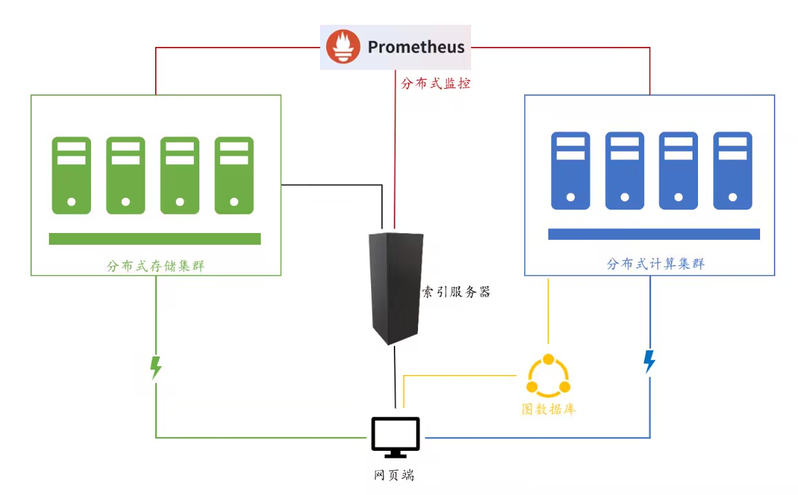

模块示意图如下:



监控是完全独立的,可以不管

部署整个项目至少需要两台电脑(主要原因为jdk版本不兼容)


图数据库部署最为简单,部署详细在x-tobedone/neo4j/中央索引服务器:neo4j&server.md中

neo4j 版本很重要 4.4用的是jdk11,最新的5.7用的是jdk17


储存集群和索引服务器的部署文档就在./非容器化部署文档.md中,需要注意的是mysql版本使用的是5,建议使用ubuntu18部署,jdk版本是8.


网页端的部署也在./非容器化部署文档.md,主要是安装tomcat之后(需要jdk支持,版本忘了),把网页文件扔进去


分布式计算集群部署文档在~/ray/部署 中,最终只需要head节点运行tag_server.py,worker通过ray的命令加入到集群,不需要额外运行文件. ray文件中只有tag文件夹和watchdog是必要的,其他都是用于测试的文件.


我们最后一共使用了三台服务器,ip地址分别如下,需要改成自己对应的服务器ip:

具体对应哪些功能我忘掉了,大致是图数据库,文件服务器,打标服务器

```
101.33.236.114

43.142.97.10

124.220.19.232
```


有问题直接联系我们或者提issue(大概是不会看,不过有邮件提醒,或许呢)


版本兼容问题真的令人头疼,这个代码量已经很大了,是屎山的样子了,没有决心不要碰吧,爱你.